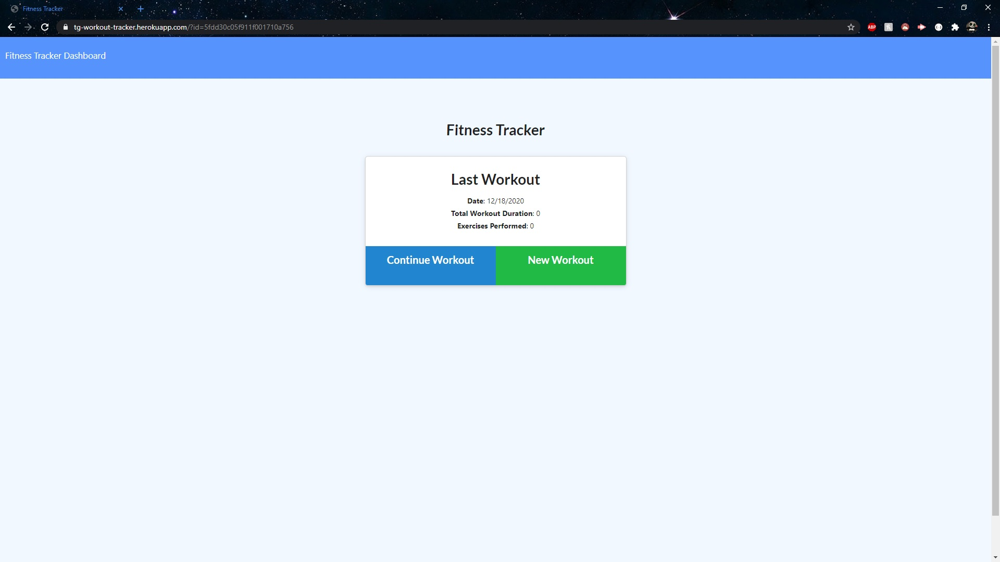
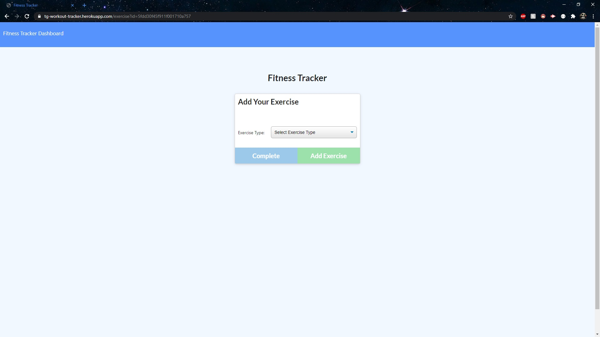
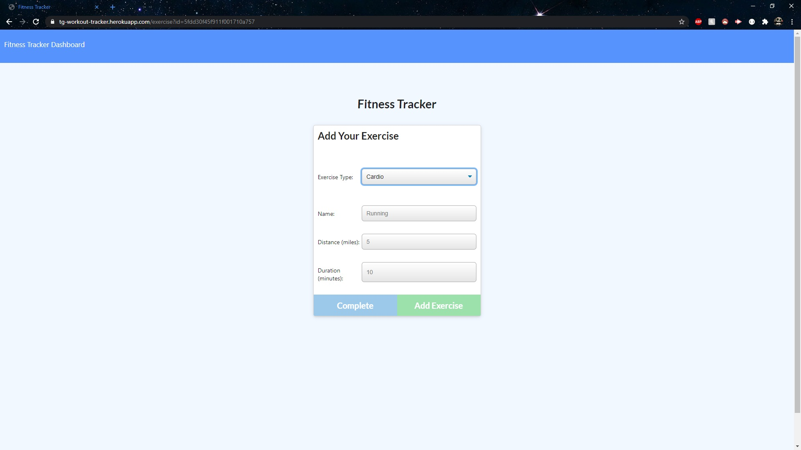
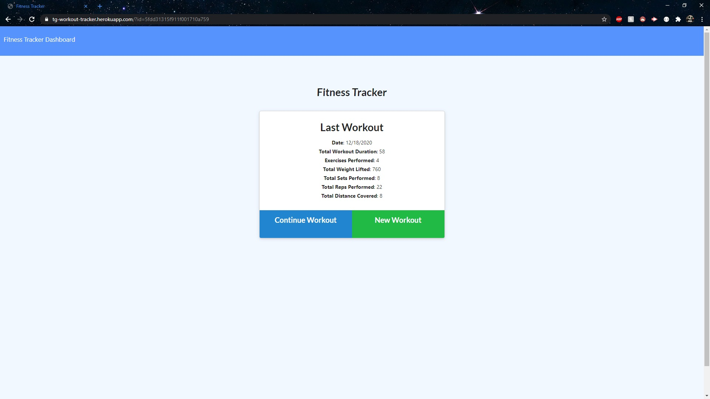
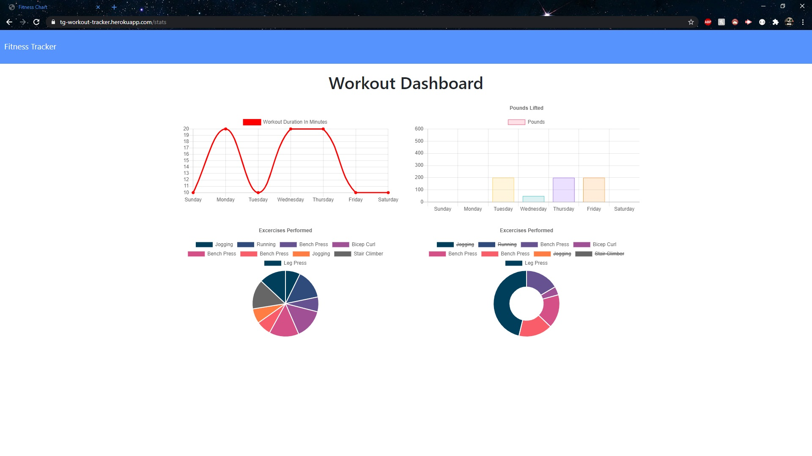

# Week 17. Workout Tracker
## By Travis Gray

## Overview

This week, I have been tasked with creating the back end for an application and by using MongoDB to tie the front and back ends together. This app is used to track workout progress and view statistics about logged workout history.

Tools and Resources used during this week's homework:
* MongoDB
* Mongoose
* Express
* Morgan
* Node.js

## Instructions for App Use

This is the main page that you will come to upon loading the website. If you've been to this site before, it will load your stats from your previous workout. If there's no data available in the database, the app will only display the green button and you will be able to create a new workout.

This page is where you will create a new workout. You can select the dropdown box and choose either Cardio or Resistance depending on which workout you'd like to enter. The app will then display the input boxes that you can enter information such as reps, weights, duration, and distance.

After you enter in your desired workout, you can either add another workout by clicking the green button or you can complete adding your exercises by clicking the blue button. After the blue button is clicked, it will redirect you back to the main screen after a couple of seconds.

Once you've entered in a few workouts, the main page will update with stats of your current workout history. If you look at the URL bar at the top of the page, you'll notice it has a unique identifier. This identifier is linked to your current workout session and will change once you click on a new workout. The final step is to click on the Dashboard option on the Navbar at the top of the screen.

This is the final page to this application. Once you've entered in some data over the past few days. This app will compile all of your workout history in the database and show a few charts and graphs with some information about all of the information that you've entered.

* [Github](https://github.com/Teknix420/TG-Workout-Tracker)
* [Heroku](https://tg-workout-tracker.herokuapp.com/)